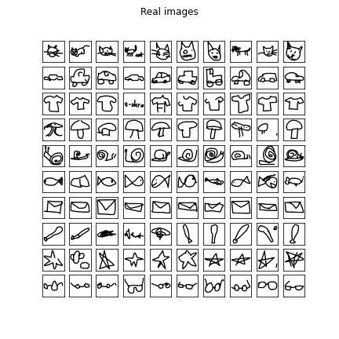
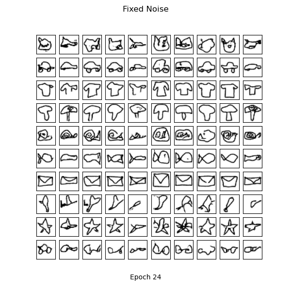
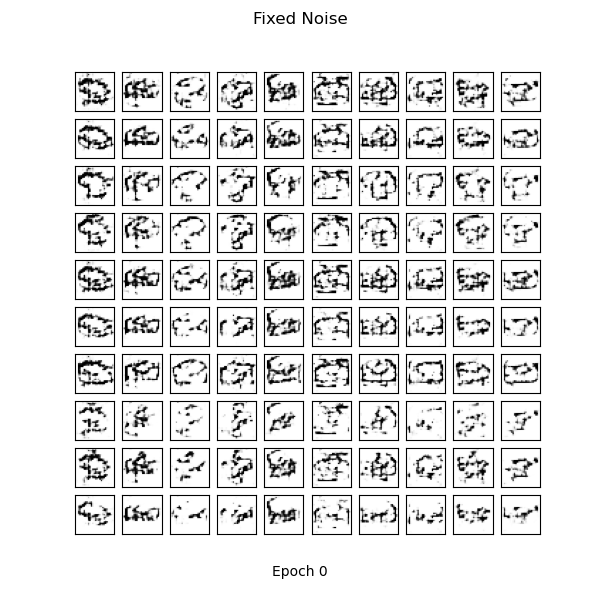

# cDCGAN Quickdraw

PyTorch implementation of the Conditional Deep Convolutional Generative Adversarial Networks (cDCGAN) for Google's Quick, Draw! [2] dataset.

## Introduction
Generative Adversarial Networks (GAN) are implicit generative deep learning models that capture the training data's distribution to be able to create new data from that same distribution. GANs were first introduced by Ian Goodfellow in 2014 [3]. As described in the paper, GANs are made up of two models: the *generator* and the *discriminator*. The *generator* can be thought of like a painting forger and the *discriminator* can be thought of as the detective. The forger (generator) is constantly trying to outsmart the detective (discriminator) by generating better and better fakes, while the detective is working to become better at correctly classifying the real and fake images. The DCGAN [1] extends this idea by using convolutional and convolutional-transpose layers in the discriminator and generator, respectively. 

## The c in cDCGAN
We can generate data conditioned on class labels by providing the GAN network with label data *y* [4]. Providing our network with label data will have two outcomes:
1. The discrimination will now have label data, which will help with training, making for a stronger discriminator.
2. The generator will now be able to draw images of the given label.

## Method
The initial model design is based on the papers [1] and [4] with addition to PyTorch's DCGAN tutorial [5]. The main implementation differences come in the form of the model architecture and use of various tricks for model stability. Things I learned:

* Favouring a simpler model in the form of less convolutional layers decreased training time and increased model stability. My generative model contains two layers of batch-normalized convolutional transpose (ConvTranspose) layers using ReLu activation and a final ConvTranspose layer with a Tanh activation. My discriminator model contains two batch-normalized convolutional layers with LeakyReLu activations with a final conv layer with a sigmoid activation. Additionally, for both models I decided to simply concatenate the conditioning label with the input with no separate processing.
* GANs are really hard to train. Using tricks like instance noise [6], label smoothing [7] and label noise help our generator by making the discriminator's job harder.

## Results
* Results compared to real images:
<table align='center'>
  <tr align='center'>
    <td> Quick, Draw! </td>
    <td> cDCGAN after 25 epochs </td>
  </tr>
  <tr>
    <td>
    <td>
  </tr>
</table>

* Images generated with fixed noise over training:
<table align='center'>
  <tr align='center'>
    <td> Training over time </td>
  </tr>
  <tr>
    <td>
  </tr>
</table>

## References

[1] [https://arxiv.org/pdf/1511.06434.pdf](https://arxiv.org/pdf/1511.06434.pdf)

[2] [https://quickdraw.withgoogle.com/data](https://quickdraw.withgoogle.com/data)

[3] [http://papers.nips.cc/paper/5423-generative-adversarial-nets.pdf](http://papers.nips.cc/paper/5423-generative-adversarial-nets.pdf)

[4] [https://arxiv.org/pdf/1411.1784.pdf](https://arxiv.org/pdf/1411.1784.pdf)

[5] [https://pytorch.org/tutorials/beginner/dcgan_faces_tutorial.html](https://pytorch.org/tutorials/beginner/dcgan_faces_tutorial.html)

[6] [https://www.inference.vc/instance-noise-a-trick-for-stabilising-gan-training/](https://www.inference.vc/instance-noise-a-trick-for-stabilising-gan-training/)

[7] [https://towardsdatascience.com/what-is-label-smoothing-108debd7ef06](https://towardsdatascience.com/what-is-label-smoothing-108debd7ef06)
